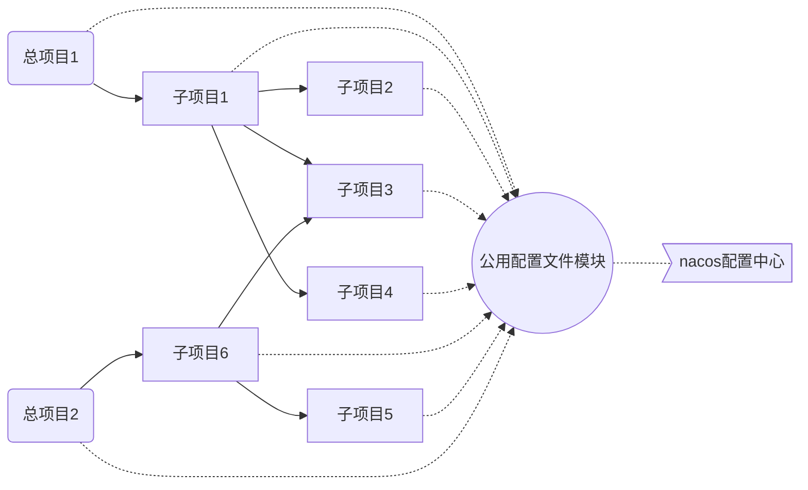

# myjavacode
my public java code

```mermaid
graph LR
A((公用配置文件模块))
B(总项目1)
C[子项目1]
D[子项目2]
E[子项目3]
F[子项目4]
G[子项目6]
I[子项目5]
J(总项目2)
K>nacos配置中心] 
    B -->C 
    C -->D
    C -->E
    C -->F
    G -->E
    G -->I
    J -->G
B-.->A    
C-.->A
D-.->A
E-.->A
F-.->A
G-.->A
I-.->A
J-.->A
A-.-K
```
